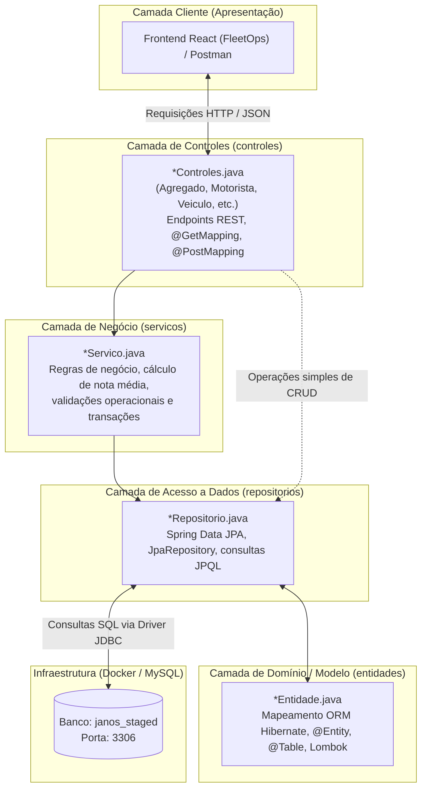

# Guia de Execução do Backend e Resumo da Arquitetura — FleetOps

> **Projeto:** Plataforma de Gestão e Gamificação de Motoristas Agregados  
> **Parceiro Acadêmico:** Newelog | FATEC SJC - 3º DSM  
> **Stack:** Java 21, Spring Boot 3, Spring Data JPA, Hibernate, MySQL 8.0, Docker

---

## Sumário

1. [Pré-requisitos](#1-pré-requisitos)
2. [Como Rodar o Backend (Passo a Passo)](#2-como-rodar-o-backend-passo-a-passo)
3. [Como Validar que o Backend está Funcionando](#3-como-validar-que-o-backend-está-funcionando)
4. [Resumo da Arquitetura do Backend](#4-resumo-da-arquitetura-do-backend)
5. [Estrutura de Pastas e Pacotes](#5-estrutura-de-pastas-e-pacotes)
6. [Transição Futura para Microsserviços](#6-transição-futura-para-microsserviços)
7. [Comandos Úteis de Manutenção e Troubleshooting](#7-comandos-úteis-de-manutenção-e-troubleshooting)

---

## 1. Pré-requisitos

Para compilar e executar o backend localmente, você precisa ter instalado na sua máquina:

- **Java Development Kit (JDK) 21:** versão LTS obrigatória para este projeto.
- **Docker e Docker Compose:** para orquestrar o banco de dados MySQL de forma isolada.
- **Git:** para versionamento de código e controle de branches.
- _(Opcional)_ **Postman**, **Insomnia** ou extensão **Thunder Client** (VS Code) para testar os endpoints da API.

---

## 2. Como Rodar o Backend (Passo a Passo)

### Passo 1: Iniciar o Serviço do Docker (Linux)

Certifique-se de que o daemon do Docker está rodando no sistema operacional:

```bash
sudo systemctl start docker
```

_(No Windows ou macOS, basta abrir o aplicativo **Docker Desktop**)._

---

### Passo 2: Subir o Banco de Dados MySQL via Docker Compose

Navegue até a pasta `backend/` onde está o arquivo `docker-compose.yml` e execute:

```bash
cd Projeto/backend
docker compose up -d
```

- **O que acontece:** O Docker baixa a imagem `mysql:8.0`, sobe o container `janos_mysql` na porta `3306` e cria automaticamente o database `janos_staged` com usuário `root` e senha `root`.
- **Dica:** Aguarde cerca de 5 a 10 segundos na primeira execução para o MySQL terminar de subir os serviços internos.

---

### Passo 3: Iniciar a Aplicação Spring Boot

Você pode iniciar o backend de duas formas:

#### Opção A: Pelo Terminal (Maven Wrapper)

Ainda dentro da pasta `Projeto/backend/`, execute:

```bash
./mvnw spring-boot:run
```

#### Opção B: Pela IDE (VS Code / IntelliJ / Eclipse)

1. Abra o arquivo principal: `src/main/java/com/fleetops/backend/BackendApplication.java`
2. Clique no botão **"Run"** ou **"Debug"** acima do método `main`.

---

## 3. Como Validar que o Backend está Funcionando

Ao iniciar a aplicação, observe o terminal/console. Você verá três confirmações de sucesso:

1. **Criação das Tabelas pelo Hibernate:**
   ```sql
   Hibernate: create table if not exists motorista (...)
   ```
2. **Mensagem do Teste de Conexão (`TesteConexaoBancoDeDados`):**
   ```text
   --------------------------------------------------
    SUCESSO! Conexão com o banco estabelecida com sucesso!
    Banco: MySQL
    URL: jdbc:mysql://localhost:3306/janos_staged...
   --------------------------------------------------
   ```
3. **Servidor Tomcat ativo na porta 8080:**
   ```text
   Tomcat started on port 8080 (http) with context path '/'
   Started BackendApplication in X.XXX seconds
   ```

### Testando uma rota rápida no navegador ou Postman:

Abra o navegador no endereço:

- `http://localhost:8080/api/motoristas/disponiveis`
- `http://localhost:8080/api/agregados`

Se o navegador retornar `[]` (um array JSON vazio com status `200 OK`), **sua API e o banco estão 100% funcionais e conectados!**

---

## 4. Resumo da Arquitetura do Backend

O backend foi construído seguindo o padrão **Arquitetura em Camadas (Layered Architecture / MVC REST)**, garantindo separação clara de responsabilidades:



### Papel de Cada Camada:

- **`controles` (REST Controllers):** Porta de entrada da API. Recebe e responde requisições HTTP em JSON, valida cabeçalhos e retorna códigos de status adequados (`200 OK`, `201 Created`, `404 Not Found`).
- **`servicos` (Business Logic / Services):** Centraliza as regras de negócio do desafio da Newelog (ex.: cálculo da nota média de motorista, validação de disponibilidade e cálculo de rentabilidade).
- **`repositorios` (Spring Data JPA):** Interfaces que abstraem o acesso ao banco. O Spring gera o código SQL de `SELECT`, `INSERT`, `UPDATE` e `DELETE` dinamicamente em tempo de execução.
- **`entidades` (ORM Entities):** Representação orientada a objetos das tabelas físicas do MySQL, com anotações de validação (`@NotBlank`, `@NotNull`, `@Size`) e Lombok.
- **`config`:** Configurações de infraestrutura, CORS e rotinas de inicialização como o teste automático de conexão.

---

## 5. Estrutura de Pastas e Pacotes

```text
backend/
├── docker-compose.yml                   # Orquestração do MySQL no Docker
├── mvnw / mvnw.cmd                      # Maven Wrapper executável
├── pom.xml                              # Dependências do projeto (Spring Boot, MySQL, Lombok)
└── src/
    └── main/
        ├── java/com/fleetops/backend/
        │   ├── BackendApplication.java  # Classe principal (Spring Boot Starter)
        │   ├── config/                  # Configurações e teste de conexão
        │   │   └── TesteConexaoBancoDeDados.java
        │   ├── controles/               # Controladores REST da API
        │   │   ├── AgregadoControles.java
        │   │   ├── AvaliacaoControles.java
        │   │   ├── ManifestoControles.java
        │   │   ├── MotoristaControles.java
        │   │   ├── UsuarioControles.java
        │   │   └── VeiculoControles.java
        │   ├── entidades/               # Entidades JPA (Mapeamento ORM)
        │   │   ├── Agregado.java
        │   │   ├── Avaliacao.java
        │   │   ├── Manifesto.java
        │   │   ├── Motorista.java
        │   │   ├── Usuario.java
        │   │   └── Veiculo.java
        │   ├── repositorios/            # Interfaces JPA Repository
        │   │   ├── AgregadoRepositorio.java
        │   │   ├── AvaliacaoRepositorio.java
        │   │   ├── ManifestoRepositorio.java
        │   │   ├── MotoristaRepositorio.java
        │   │   ├── UsuarioRepositorio.java
        │   │   └── VeiculoRepositorio.java
        │   └── servicos/                # Serviços e regras de negócio
        └── resources/
            ├── application.properties   # Configurações de URL, banco, senha e JPA
            └── schema.sql               # Script DDL físico de segurança das tabelas
```

---

## 6. Transição Futura para Microsserviços

O backend foi construído no modelo **Monolito Modular Preparado**:

- **Desacoplamento em Pacotes:** Cada domínio (Frota, Motoristas, Operações/Manifestos, Avaliações/Gamificação) possui suas próprias entidades e repositórios delimitados.
- **Relacionamentos com Carregamento Preguiçoso (`FetchType.LAZY`):** Impede acoplamento circular entre tabelas de contextos distintos.
- **Documentação Arquitetural de Apoio:** Para entender a estratégia de migração para o padrão **Database-per-Service** com mensageria RabbitMQ e eventual consistência, consulte o documento `us1-BD.md` na raiz do repositório.

---

## 7. Comandos Úteis de Manutenção e Troubleshooting

### Docker e Banco de Dados

| Ação                                  | Comando                                                     |
| :------------------------------------ | :---------------------------------------------------------- |
| **Iniciar o banco**                   | `docker compose up -d`                                      |
| **Verificar se está rodando**         | `docker compose ps`                                         |
| **Ver logs do MySQL**                 | `docker compose logs -f mysql-db`                           |
| **Acessar o terminal do MySQL**       | `docker exec -it janos_mysql mysql -u root -p janos_staged` |
| **Pausar o banco (sem apagar dados)** | `docker compose stop`                                       |
| **Derrubar e apagar dados de teste**  | `docker compose down -v`                                    |

### Maven e Spring Boot

| Ação                                        | Comando                  |
| :------------------------------------------ | :----------------------- |
| **Compilar o projeto**                      | `./mvnw clean compile`   |
| **Rodar a aplicação**                       | `./mvnw spring-boot:run` |
| **Rodar os testes automatizados**           | `./mvnw test`            |
| **Aplicar formatação de código (Spotless)** | `./mvnw spotless:apply`  |

### Solução de Problemas Comuns

- **Erro: `Communications link failure` ao iniciar o Spring Boot:**
  - _Causa:_ O container do Docker não está rodando.
  - _Solução:_ Execute `docker compose up -d` na pasta `backend/`.
- **Erro: `Port 3306 already in use` ao subir o Docker:**
  - _Causa:_ Você já tem outro serviço de MySQL rodando na sua máquina Linux nativa.
  - _Solução:_ Pare o serviço local com `sudo systemctl stop mysql` e rode `docker compose up -d` novamente.
