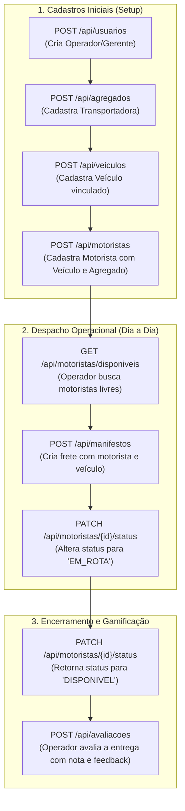

# Dicionário de Dados e Modelos JSON da API — FleetOps (NewLogística)

> **Projeto:** Plataforma de Gestão e Gamificação de Motoristas Agregados  
> **Parceiro Acadêmico:** Newelog | FATEC SJC - 3º DSM  
> **Banco de Dados:** `janos_staged` (MySQL 8.0)  
> **Convenção:** No banco os campos usam `snake_case`, e no Java/JSON da API utiliza-se `camelCase`.

---

## Sumário

1. [Resumo das Rotas Atuais dos Controles](#1-resumo-das-rotas-atuais-dos-controles)
2. [Visão Geral de Padrões e Cabeçalhos HTTP](#2-visão-geral-de-padrões-e-cabeçalhos-http)
3. [Tabela 1: `usuario` (Usuário do Sistema)](#3-tabela-1-usuario-usuário-do-sistema)
4. [Tabela 2: `agregado` (Parceiro Frotista)](#4-tabela-2-agregado-parceiro-frotista)
5. [Tabela 3: `veiculo` (Veículo da Frota)](#5-tabela-3-veiculo-veículo-da-frota)
6. [Tabela 4: `motorista` (Motorista Parceiro)](#6-tabela-4-motorista-motorista-parceiro)
7. [Tabela 5: `manifesto` (Registro de Viagem / Frete)](#7-tabela-5-manifesto-registro-de-viagem--frete)
8. [Tabela 6: `avaliacao` (Feedback e Avaliação Operacional)](#8-tabela-6-avaliacao-feedback-e-avaliação-operacional)
9. [Dicas de Integração Frontend (React) e Boas Práticas](#9-dicas-de-integração-frontend-react-e-boas-práticas)

---

## 1. Resumo das Rotas Atuais dos Controles

Abaixo está o mapa completo de todas as rotas REST implementadas no pacote `com.fleetops.backend.controles`, detalhando o método HTTP, rota, payload esperado, status HTTP de retorno e o papel de cada operação na regra de negócio:

### Matriz Geral de Endpoints da API

| Controle                 | Método  | Endpoint                      | Parâmetros / Corpo Esperado                                               |   Retorno HTTP   | Descrição da Operação                                                                                                                       |                                 Detalhes                                  |
| :----------------------- | :-----: | :---------------------------- | :------------------------------------------------------------------------ | :--------------: | :------------------------------------------------------------------------------------------------------------------------------------------ | :-----------------------------------------------------------------------: |
| **`AgregadoControles`**  |  `GET`  | `/api/agregados`              | _Nenhum_                                                                  |     `200 OK`     | Retorna a lista de todos os parceiros frotistas cadastrados.                                                                                |           [Ver tabela](#4-tabela-2-agregado-parceiro-frotista)            |
|                          |  `GET`  | `/api/agregados/{id}`         | `id` (na URL)                                                             | `200 OK` / `404` | Retorna os dados de um parceiro específico pelo identificador.                                                                              |           [Ver tabela](#4-tabela-2-agregado-parceiro-frotista)            |
|                          | `POST`  | `/api/agregados`              | JSON com dados do agregado                                                |  `201 Created`   | Cadastra uma nova empresa frotista parceira no banco.                                                                                       |        [Ver JSON](#exemplo-de-json-para-criação-post-apiagregados)        |
| **`UsuarioControles`**   |  `GET`  | `/api/usuarios`               | _Nenhum_                                                                  |     `200 OK`     | Lista todos os operadores e gerentes do sistema.                                                                                            |           [Ver tabela](#3-tabela-1-usuario-usuário-do-sistema)            |
|                          |  `GET`  | `/api/usuarios/{id}`          | `id` (na URL)                                                             | `200 OK` / `404` | Retorna os dados de um usuário específico por ID.                                                                                           |           [Ver tabela](#3-tabela-1-usuario-usuário-do-sistema)            |
|                          | `POST`  | `/api/usuarios`               | JSON com dados do usuário                                                 |  `201 Created`   | Cadastra um novo operador ou gestor na plataforma.                                                                                          |        [Ver JSON](#exemplo-de-json-para-criação-post-apiusuarios)         |
| **`VeiculoControles`**   |  `GET`  | `/api/veiculos`               | _Nenhum_                                                                  |     `200 OK`     | Lista todos os veículos registrados na frota agregada.                                                                                      |            [Ver tabela](#5-tabela-3-veiculo-veículo-da-frota)             |
|                          |  `GET`  | `/api/veiculos/{id}`          | `id` (na URL)                                                             | `200 OK` / `404` | Retorna os dados detalhados de um veículo pelo ID.                                                                                          |            [Ver tabela](#5-tabela-3-veiculo-veículo-da-frota)             |
|                          | `POST`  | `/api/veiculos`               | JSON com veículo e `idAgregado`                                           |  `201 Created`   | Cadastra um novo veículo vinculado a uma transportadora parceira.                                                                           |        [Ver JSON](#exemplo-de-json-para-criação-post-apiveiculos)         |
| **`MotoristaControles`** |  `GET`  | `/api/motoristas`             | _Nenhum_                                                                  |     `200 OK`     | Lista todos os motoristas cadastrados na base.                                                                                              |          [Ver tabela](#6-tabela-4-motorista-motorista-parceiro)           |
|                          |  `GET`  | `/api/motoristas/disponiveis` | _Nenhum_                                                                  |     `200 OK`     | **Regra Central Newelog:** Filtra e retorna apenas motoristas com status `"Disponível"` para alocação rápida sem duplicidade.               |          [Ver tabela](#6-tabela-4-motorista-motorista-parceiro)           |
|                          |  `GET`  | `/api/motoristas/disponiveis` | _Nenhum_                                                                  |     `200 OK`     | **Regra Central Newelog:** Filtra e retorna apenas motoristas com status `"DISPONIVEL"` em tempo real para alocação rápida sem duplicidade. |          [Ver tabela](#6-tabela-4-motorista-motorista-parceiro)           |
|                          |  `GET`  | `/api/motoristas/{id}`        | `id` (na URL)                                                             | `200 OK` / `404` | Retorna o motorista pelo ID com dados do veículo (1:1) e agregado.                                                                          |          [Ver tabela](#6-tabela-4-motorista-motorista-parceiro)           |
|                          | `POST`  | `/api/motoristas`             | JSON com motorista, `idVeiculo` e `idAgregado`                            |  `201 Created`   | Cadastra um novo motorista parceiro vinculado à frota.                                                                                      |       [Ver JSON](#exemplo-de-json-para-criação-post-apimotoristas)        |
|                          | `PATCH` | `/api/motoristas/{id}/status` | JSON: `{"status": "Em Rota"}`                                             | `200 OK` / `404` | **Disponibilidade Dinâmica:** Altera rapidamente o status operacional (`Disponível`, `Em Rota`, `Folga`, `Manutenção`, `Inativo`).          | [Ver JSON](#exemplo-de-atualização-de-status-put-ou-patch-apimotoristas1) |
|                          | `PATCH` | `/api/motoristas/{id}/status` | JSON: `{"status": "EM_ROTA"}`                                             | `200 OK` / `404` | **Disponibilidade Dinâmica:** Altera rapidamente o status operacional (`DISPONIVEL`, `EM_ROTA`, `INDISPONIVEL`, `INDESEJADO`).              | [Ver JSON](#exemplo-de-atualização-de-status-put-ou-patch-apimotoristas1) |
| **`ManifestoControles`** |  `GET`  | `/api/manifestos`             | _Nenhum_                                                                  |     `200 OK`     | Retorna a listagem histórica de viagens e manifestos de carga emitidos.                                                                     |       [Ver tabela](#7-tabela-5-manifesto-registro-de-viagem--frete)       |
|                          |  `GET`  | `/api/manifestos/{id}`        | `id` (na URL)                                                             | `200 OK` / `404` | Detalha uma viagem específica, seus custos e profissionais envolvidos.                                                                      |       [Ver tabela](#7-tabela-5-manifesto-registro-de-viagem--frete)       |
|                          | `POST`  | `/api/manifestos`             | JSON com valores, `idMotorista`, `idVeiculo`, `idAgregado`                |  `201 Created`   | Registra uma nova operação de transporte, viabilizando o cálculo de rentabilidade.                                                          |       [Ver JSON](#exemplo-de-json-para-criação-post-apimanifestos)        |
| **`AvaliacaoControles`** |  `GET`  | `/api/avaliacoes`             | _Nenhum_                                                                  |     `200 OK`     | Lista todos os feedbacks e pontuações atribuídas a fretes.                                                                                  |   [Ver tabela](#8-tabela-6-avaliacao-feedback-e-avaliação-operacional)    |
|                          |  `GET`  | `/api/avaliacoes/{id}`        | `id` (na URL)                                                             | `200 OK` / `404` | Retorna uma avaliação específica por ID.                                                                                                    |   [Ver tabela](#8-tabela-6-avaliacao-feedback-e-avaliação-operacional)    |
|                          | `POST`  | `/api/avaliacoes`             | JSON com nota (1-10), feedback, `idUsuario`, `idMotorista`, `idManifesto` |  `201 Created`   | Registra avaliação pós-viagem para alimentar a gamificação e nota média do motorista.                                                       |       [Ver JSON](#exemplo-de-json-para-criação-post-apiavaliacoes)        |

---

### Fluxo Operacional Recomendado (Ciclo de Vida das Rotas)

Para que a aplicação funcione de forma integrada no dia a dia da transportadora parceira, as rotas seguem este fluxo natural de execução:



---

### Resumo por Classe de Controle e Papel no Negócio

1. **`AgregadoControles`:** Gerencia as empresas frotistas parceiras da transportadora. É a raiz da hierarquia, pois veículos e contratos de motoristas estão diretamente associados a um frotista.
2. **`UsuarioControles`:** Centraliza o cadastro de operadores e gestores, viabilizando a auditoria e rastreabilidade de quem cadastra veículos, despacha motoristas e avalia o serviço.
3. **`VeiculoControles`:** Controla a frota agregada categorizada pelas tipologias da Newelog (`FIORINO`, `VAN`, `VUC`, `TRES_QUARTOS`, `TOCO`, `TRUCK`, `CARRETA`), fornecendo busca filtrada (`/tipo/{tipo}`) para escolha ágil do veículo adequado à cubagem da carga.
4. **`MotoristaControles`:** **Coração operacional da plataforma.** Fornece a busca otimizada por profissionais disponíveis (`/disponiveis`) e atualização de status em tempo real (`/{id}/status`), eliminando a perda de tempo com contatos duplicados por múltiplos operadores.
5. **`ManifestoControles`:** Registra as viagens realizadas com seus valores brutos e fretes pagos, servindo de base para calcular a rentabilidade da operação ($\text{Valor Recebido} - \text{Custos}$) e a média de utilização mensal.
6. **`AvaliacaoControles`:** Alimenta a gamificação da Newelog, permitindo avaliar a pontualidade e o estado da entrega, calculando a nota média de 0.0 a 10.0 exibida nos dashboards gerenciais.

---

## 2. Visão Geral de Padrões e Cabeçalhos HTTP

Ao interagir com a API em formato JSON via Postman, Insomnia ou frontend React (`axios`/`fetch`):

- **Cabeçalhos obrigatórios em requisições com corpo (`POST`/`PUT`):**
  ```http
  Content-Type: application/json
  Accept: application/json
  ```
- **Formatos de Tipos Especiais:**
  - **Datas:** padrão ISO `YYYY-MM-DD` (exemplo: `"2026-09-21"`).
  - **Valores Monetários / Decimais:** formato numérico com ponto (exemplo: `1250.50`).
  - **Booleanos:** `true` ou `false` (literais JSON, sem aspas).
  - **Chaves Estrangeiras:** Quando a entidade recebe um relacionamento JPA direto, basta enviar um objeto contendo o ID correspondente (exemplo: `"agregado": { "idAgregado": 1 }`).

---

## 3. Tabela 1: `usuario` (Usuário do Sistema)

Armazena os operadores logísticos, administradores e gerentes que acessam a plataforma.

### Dicionário de Dados

| Coluna BD (`schema.sql`) | Propriedade JSON / Java | Tipo SQL       | Tipo Java / JSON  | Obrigatório | Restrições / Validações                  | Descrição                                         |
| :----------------------- | :---------------------- | :------------- | :---------------- | :---------: | :--------------------------------------- | :------------------------------------------------ |
| `id_usuario`             | `idUsuario`             | `INT`          | `Long` / `Number` | Não (Auto)  | `PRIMARY KEY`, `AUTO_INCREMENT`          | Identificador único do usuário gerado pelo banco. |
| `nome_usuario`           | `nomeUsuario`           | `VARCHAR(100)` | `String`          |   **Sim**   | Máx. 100 caracteres, `@NotBlank`         | Nome completo do operador ou gerente.             |
| `email_usuario`          | `emailUsuario`          | `VARCHAR(150)` | `String`          |   **Sim**   | `UNIQUE`, formato `@Email`, Máx. 150     | E-mail corporativo de login no sistema.           |
| `senha_usuario`          | `senhaUsuario`          | `VARCHAR(255)` | `String`          |   **Sim**   | Máx. 255 caracteres                      | Senha de acesso (em produção armazena hash).      |
| `permissao_gerente`      | `permissaoGerente`      | `BOOLEAN`      | `Boolean`         |     Não     | Default: `false`                         | Indica se o usuário possui privilégios de gestor. |
| `perfil_acesso`          | `perfilAcesso`          | `VARCHAR(50)`  | `String`          |     Não     | Máx. 50 (`ADMIN`, `GERENTE`, `OPERADOR`) | Nível de acesso e permissões na interface.        |

### Exemplo de JSON para Criação (`POST /api/usuarios`)

```json
{
  "nomeUsuario": "Pedro Chaim",
  "emailUsuario": "pedro.operador@fleetops.com",
  "senhaUsuario": "SenhaForte@2026",
  "permissaoGerente": true,
  "perfilAcesso": "GERENTE"
}
```

### Exemplo de Resposta da API (`201 Created` ou `200 OK`)

```json
{
  "idUsuario": 1,
  "nomeUsuario": "Pedro Chaim",
  "emailUsuario": "pedro.operador@fleetops.com",
  "senhaUsuario": "SenhaForte@2026",
  "permissaoGerente": true,
  "perfilAcesso": "GERENTE"
}
```

---

## 4. Tabela 2: `agregado` (Parceiro Frotista)

Representa a empresa terceira parceira que possui os veículos e/ou motoristas agregados.

### Dicionário de Dados

| Coluna BD (`schema.sql`) | Propriedade JSON / Java | Tipo SQL       | Tipo Java / JSON  | Obrigatório | Restrições / Validações             | Descrição                                                 |
| :----------------------- | :---------------------- | :------------- | :---------------- | :---------: | :---------------------------------- | :-------------------------------------------------------- |
| `id_agregado`            | `idAgregado`            | `INT`          | `Long` / `Number` | Não (Auto)  | `PRIMARY KEY`, `AUTO_INCREMENT`     | Identificador único da empresa parceira.                  |
| `nome_agregado`          | `nomeAgregado`          | `VARCHAR(150)` | `String`          |   **Sim**   | Máx. 150 caracteres, `@NotBlank`    | Razão Social ou Nome Fantasia da transportadora agregada. |
| `cnpj_agregado`          | `cnpjAgregado`          | `VARCHAR(14)`  | `String`          |   **Sim**   | `UNIQUE`, Máx. 14 dígitos numéricos | CNPJ da empresa agregada (sem pontuação).                 |
| `contato_agregado`       | `contatoAgregado`       | `VARCHAR(20)`  | `String`          |     Não     | Máx. 20 caracteres                  | Telefone/WhatsApp institucional da transportadora.        |

### Exemplo de JSON para Criação (`POST /api/agregados`)

```json
{
  "nomeAgregado": "Transportes Carga Certa Ltda",
  "cnpjAgregado": "12345678000199",
  "contatoAgregado": "1239218800"
}
```

### Exemplo de Resposta da API

```json
{
  "idAgregado": 1,
  "nomeAgregado": "Transportes Carga Certa Ltda",
  "cnpjAgregado": "12345678000199",
  "contatoAgregado": "1239218800"
}
```

---

## 5. Tabela 3: `veiculo` (Veículo da Frota)

Armazena os veículos da frota agregada. Cada veículo pertence obrigatoriamente a um agregado.

### Dicionário de Dados

| Coluna BD (`schema.sql`) | Propriedade JSON / Java | Tipo SQL      | Tipo Java / JSON                 | Obrigatório | Restrições / Validações                            | Descrição                                                                  |
| :----------------------- | :---------------------- | :------------ | :------------------------------- | :---------: | :------------------------------------------------- | :------------------------------------------------------------------------- |
| `id_veiculo`             | `idVeiculo`             | `INT`         | `Long` / `Number`                | Não (Auto)  | `PRIMARY KEY`, `AUTO_INCREMENT`                    | Identificador único do automóvel.                                          |
| `placa_veiculo`          | `placaVeiculo`          | `VARCHAR(7)`  | `String`                         |   **Sim**   | `UNIQUE`, 7 caracteres (Mercosul ou padrão antigo) | Placa do veículo (ex: `ABC1D23` ou `ABC1234`).                             |
| `ano_fabricacao`         | `anoFabricacao`         | `INT`         | `Integer` / `Number`             |     Não     | Ano numérico (ex: `2021`)                          | Ano em que o veículo foi fabricado.                                        |
| `tipo_veiculo`           | `tipoVeiculo`           | `VARCHAR(50)` | `Enum (TipoVeiculos)` / `String` |     Não     | Categorias Newelog (Enum)                          | Enum: `FIORINO`, `VAN`, `VUC`, `TRES_QUARTOS`, `TOCO`, `TRUCK`, `CARRETA`. |
| `subtipo_veiculo`        | `subtipoVeiculo`        | `VARCHAR(50)` | `String`                         |     Não     | Máx. 50                                            | Tipo de carroceria: `Baú`, `Sider`, `Refrigerado`, `Aberto`.               |
| `fk_id_agregado`         | `agregado`              | `INT`         | `Object` (`idAgregado`)          |   **Sim**   | `FOREIGN KEY` referenciando `agregado`             | Parceiro frotista dono deste veículo.                                      |

### Exemplo de JSON para Criação (`POST /api/veiculos`)

```json
{
  "placaVeiculo": "VXX3L65",
  "anoFabricacao": 2021,
  "tipoVeiculo": "FIORINO",
  "subtipoVeiculo": "Baú Refrigerado",
  "agregado": {
    "idAgregado": 1
  }
}
```

### Exemplo de Resposta da API

```json
{
  "idVeiculo": 1,
  "placaVeiculo": "VXX3L65",
  "anoFabricacao": 2021,
  "tipoVeiculo": "FIORINO",
  "subtipoVeiculo": "Baú Refrigerado",
  "agregado": {
    "idAgregado": 1,
    "nomeAgregado": "Transportes Carga Certa Ltda",
    "cnpjAgregado": "12345678000199",
    "contatoAgregado": "1239218800"
  }
}
```

---

## 6. Tabela 4: `motorista` (Motorista Parceiro)

O motorista é o centro operacional da plataforma da Newelog. Possui vínculo com um agregado e um veículo dedicado (relação 1:1), além de armazenar seu status de disponibilidade em tempo real.

### Dicionário de Dados

| Coluna BD (`schema.sql`) | Propriedade JSON / Java | Tipo SQL       | Tipo Java / JSON                    | Obrigatório | Restrições / Validações                | Descrição                                                            |
| :----------------------- | :---------------------- | :------------- | :---------------------------------- | :---------: | :------------------------------------- | :------------------------------------------------------------------- |
| `id_motorista`           | `idMotorista`           | `INT`          | `Long` / `Number`                   | Não (Auto)  | `PRIMARY KEY`, `AUTO_INCREMENT`        | Identificador único do motorista.                                    |
| `nome_motorista`         | `nomeMotorista`         | `VARCHAR(100)` | `String`                            |   **Sim**   | Máx. 100 caracteres, `@NotBlank`       | Nome completo do motorista.                                          |
| `cpf_motorista`          | `cpfMotorista`          | `VARCHAR(11)`  | `String`                            |   **Sim**   | `UNIQUE`, 11 dígitos numéricos         | CPF sem pontuação.                                                   |
| `contato_motorista`      | `contatoMotorista`      | `VARCHAR(20)`  | `String`                            |     Não     | Máx. 20 caracteres                     | Telefone celular ou WhatsApp para acionamento rápido.                |
| `status`                 | `status`                | `VARCHAR(30)`  | `Enum (StatusMotorista)` / `String` |     Não     | Default: `'DISPONIVEL'`                | Enum: `'DISPONIVEL'`, `'EM_ROTA'`, `'INDISPONIVEL'`, `'INDESEJADO'`. |
| `ultimo_manifesto`       | `ultimoManifesto`       | `DATE`         | `String` (ISO Date)                 |     Não     | Formato `YYYY-MM-DD`                   | Data da última viagem realizada pelo profissional.                   |
| `contador_rota_sp`       | `contadorRotaSp`        | `INT`          | `Integer` / `Number`                |     Não     | Default: `0`                           | Quantidade de viagens que envolveram o estado/região de SP.          |
| `nota_media`             | `notaMedia`             | `FLOAT`        | `Float` / `Number`                  |     Não     | Default: `0.0` (de 0.0 a 10.0)         | Média calculada das avaliações recebidas.                            |
| `fk_id_veiculo`          | `veiculo`               | `INT`          | `Object` (`idVeiculo`)              |     Não     | `UNIQUE`, `FOREIGN KEY` (1:1)          | Veículo padrão conduzido por este motorista.                         |
| `fk_id_agregado`         | `agregado`              | `INT`          | `Object` (`idAgregado`)             |   **Sim**   | `FOREIGN KEY` referenciando `agregado` | Agregado ao qual o motorista é contratado/associado.                 |

### Exemplo de JSON para Criação (`POST /api/motoristas`)

```json
{
  "nomeMotorista": "João Carlos Rodrigues",
  "cpfMotorista": "12345678901",
  "contatoMotorista": "12981112233",
  "status": "DISPONIVEL",
  "contadorRotaSp": 0,
  "notaMedia": 0.0,
  "veiculo": {
    "idVeiculo": 1
  },
  "agregado": {
    "idAgregado": 1
  }
}
```

### Exemplo de Atualização de Status (`PATCH /api/motoristas/1/status`)

```json
{
  "status": "EM_ROTA"
}
```

---

## 7. Tabela 5: `manifesto` (Registro de Viagem / Frete)

Registra a operação de transporte executada. Conecta o motorista, o veículo utilizado e a transportadora parceira aos valores financeiros do frete.

### Dicionário de Dados

| Coluna BD (`schema.sql`) | Propriedade JSON / Java | Tipo SQL        | Tipo Java / JSON         | Obrigatório | Restrições / Validações         | Descrição                                        |
| :----------------------- | :---------------------- | :-------------- | :----------------------- | :---------: | :------------------------------ | :----------------------------------------------- |
| `id_manifesto`           | `idManifesto`           | `INT`           | `Long` / `Number`        | Não (Auto)  | `PRIMARY KEY`, `AUTO_INCREMENT` | Identificador único do manifesto/frete.          |
| `data_manifesto`         | `dataManifesto`         | `DATE`          | `String` (ISO Date)      |     Não     | Formato `YYYY-MM-DD`            | Data de emissão/execução da rota.                |
| `destino`                | `destino`               | `VARCHAR(100)`  | `String`                 |     Não     | Máx. 100 caracteres             | Cidade ou região de entrega da carga.            |
| `valor_recebido`         | `valorRecebido`         | `DECIMAL(12,2)` | `BigDecimal` / `Number`  |     Não     | 12 dígitos, 2 decimais          | Valor bruto faturado/recebido pela operação.     |
| `frete`                  | `frete`                 | `DECIMAL(12,2)` | `BigDecimal` / `Number`  |     Não     | 12 dígitos, 2 decimais          | Valor pago de frete ao transportador.            |
| `aereo`                  | `aereo`                 | `BOOLEAN`       | `Boolean`                |     Não     | Default: `false`                | Indica se a rota envolve conexão ou frete aéreo. |
| `fk_id_motorista`        | `motorista`             | `INT`           | `Object` (`idMotorista`) |   **Sim**   | `FOREIGN KEY` para `motorista`  | Motorista que executou a viagem.                 |
| `fk_id_agregado`         | `agregado`              | `INT`           | `Object` (`idAgregado`)  |   **Sim**   | `FOREIGN KEY` para `agregado`   | Empresa parceira vinculada ao frete.             |
| `fk_id_veiculo`          | `veiculo`               | `INT`           | `Object` (`idVeiculo`)   |   **Sim**   | `FOREIGN KEY` para `veiculo`    | Veículo utilizado na rota.                       |

### Exemplo de JSON para Criação (`POST /api/manifestos`)

```json
{
  "dataManifesto": "2026-09-21",
  "destino": "São Paulo - SP (Zona Sul)",
  "valorRecebido": 3500.0,
  "frete": 2200.0,
  "aereo": false,
  "motorista": {
    "idMotorista": 1
  },
  "agregado": {
    "idAgregado": 1
  },
  "veiculo": {
    "idVeiculo": 1
  }
}
```

### Exemplo de Resposta da API

```json
{
  "idManifesto": 1,
  "dataManifesto": "2026-09-21",
  "destino": "São Paulo - SP (Zona Sul)",
  "valorRecebido": 3500.0,
  "frete": 2200.0,
  "aereo": false,
  "motorista": {
    "idMotorista": 1,
    "nomeMotorista": "João Carlos Rodrigues"
  },
  "agregado": {
    "idAgregado": 1,
    "nomeAgregado": "Transportes Carga Certa Ltda"
  },
  "veiculo": {
    "idVeiculo": 1,
    "placaVeiculo": "VXX3L65"
  }
}
```

---

## 8. Tabela 6: `avaliacao` (Feedback e Avaliação Operacional)

Representa o feedback gerado pelo operador sobre o desempenho do motorista em um determinado manifesto de carga (base para o ranking e gamificação).

### Dicionário de Dados

| Coluna BD (`schema.sql`) | Propriedade JSON / Java | Tipo SQL       | Tipo Java / JSON         | Obrigatório | Restrições / Validações         | Descrição                                           |
| :----------------------- | :---------------------- | :------------- | :----------------------- | :---------: | :------------------------------ | :-------------------------------------------------- |
| `id_comentario`          | `idComentario`          | `INT`          | `Long` / `Number`        | Não (Auto)  | `PRIMARY KEY`, `AUTO_INCREMENT` | Identificador único do registro de avaliação.       |
| `fk_id_usuario`          | `usuario`               | `INT`          | `Object` (`idUsuario`)   |   **Sim**   | `FOREIGN KEY` para `usuario`    | Usuário/Operador logístico que redigiu a avaliação. |
| `fk_id_motorista`        | `motorista`             | `INT`          | `Object` (`idMotorista`) |   **Sim**   | `FOREIGN KEY` para `motorista`  | Motorista que está sendo avaliado.                  |
| `fk_id_manifesto`        | `manifesto`             | `INT`          | `Object` (`idManifesto`) |   **Sim**   | `FOREIGN KEY` para `manifesto`  | Viagem específica à qual o feedback se refere.      |
| `feedback`               | `feedback`              | `VARCHAR(500)` | `String`                 |     Não     | Máx. 500 caracteres             | Texto descritivo com observações operacionais.      |
| `nota_comentario`        | `notaComentario`        | `INT`          | `Integer` / `Number`     |     Não     | Nota inteira (ex: de 1 a 10)    | Pontuação atribuída pelo operador.                  |

### Exemplo de JSON para Criação (`POST /api/avaliacoes`)

```json
{
  "usuario": {
    "idUsuario": 1
  },
  "motorista": {
    "idMotorista": 1
  },
  "manifesto": {
    "idManifesto": 1
  },
  "feedback": "Motorista muito pontual na coleta e no descarregamento em São Paulo. Carga entregue sem avarias.",
  "notaComentario": 10
}
```

### Exemplo de Resposta da API

```json
{
  "idComentario": 1,
  "feedback": "Motorista muito pontual na coleta e no descarregamento em São Paulo. Carga entregue sem avarias.",
  "notaComentario": 10,
  "usuario": {
    "idUsuario": 1,
    "nomeUsuario": "Pedro Chaim"
  },
  "motorista": {
    "idMotorista": 1,
    "nomeMotorista": "João Carlos Rodrigues"
  },
  "manifesto": {
    "idManifesto": 1,
    "destino": "São Paulo - SP (Zona Sul)"
  }
}
```

---

## 9. Dicas de Integração Frontend (React) e Boas Práticas

### 1. Evitando Loops Infinitos de Serialização (`@JsonIgnoreProperties`)

No Java/Spring Boot, quando uma entidade aponta para outra (ex: `Motorista` $\leftrightarrow$ `Veiculo`), o Jackson pode tentar serializar em ciclo infinito. A melhor prática em entidades é usar a anotação:

```java
@JsonIgnoreProperties({"hibernateLazyInitializer", "handler"})
```

Nas classes de entidade para evitar erros de proxy do Hibernate na hora de gerar o JSON.

### 2. Uso de DTOs (Data Transfer Objects)

Para produção, a melhor arquitetura é criar classes DTO simples para receber os dados do JSON, por exemplo `MotoristaCadastroDTO`, onde você recebe diretamente `Long idVeiculo` e `Long idAgregado` em vez de objetos aninhados. Isso deixa o payload JSON ainda mais limpo:

```json
{
  "nomeMotorista": "João Carlos",
  "cpfMotorista": "12345678901",
  "idVeiculo": 1,
  "idAgregado": 1
}
```

E no seu Service você busca os objetos pelos IDs antes de salvar.

### 3. Exemplo de chamada no React (`fetch` / `axios`):

```javascript
// Exemplo de criação de novo agregado no React
const cadastrarAgregado = async (dados) => {
  const response = await fetch("http://localhost:8080/api/agregados", {
    method: "POST",
    headers: {
      "Content-Type": "application/json",
    },
    body: JSON.stringify({
      nomeAgregado: dados.nome,
      cnpjAgregado: dados.cnpj,
      contatoAgregado: dados.telefone,
    }),
  });
  return await response.json();
};
```
